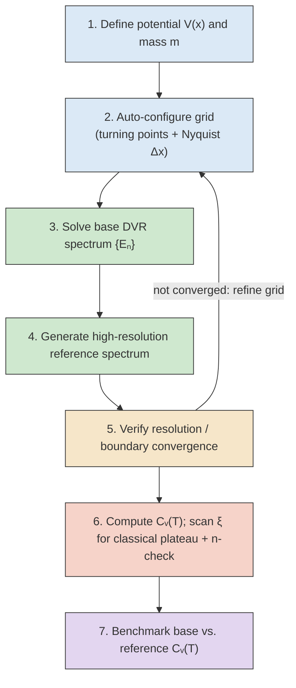

# Quantum-Classical Heat Capacity

This repository contains the simulation code and mathematical derivations for studying the convergence of quantum systems to their classical limits, specifically focusing on the heat capacity ($C_v$) of various potential energy systems.

## Project Overview

This project investigates the quantum-to-classical transition using a scaling factor, $\xi$, which effectively scales $\hbar \rightarrow 0$ by scaling the temperature and potential energy. The core objective is to identify a stable $\xi$-plateau where the calculated heat capacity converges to the classical limit predicted by the Equipartition Theorem.

## Key Features & Algorithms

### DVR Algorithm
A Discrete Variable Representation (DVR) solver used to compute energy eigenvalues. It has been optimized for smooth potentials, enforcing strict computational contracts to ensure stability.

### Phase-Space Auto-Scanner (v1.6+)
Dynamically optimizes grid density ($N$) and spatial bounds ($[x_{\min}, x_{\max}]$) based on the Nyquist-Shannon sampling theorem to prevent aliasing.

### $\xi$-Convergence Module
An automated search that navigates the narrow stability window defined by

$$
\sqrt{\beta \Delta E} \ll \xi \ll \sqrt{\beta E_{\max}}
$$

This ensures the system reaches the classical continuum limit without suffering from finite-$N$ truncation.

### Performance Optimization
Includes decoupled diagnostic timers, grid padding refinements, and matrix-free approaches to overcome $\mathcal{O}(N^3)$ complexity limitations.

## Mathematical Foundations

The project explores two primary systems.

### 1. Harmonic Oscillator (HO)

#### Quantum Limit
Analytical derivation of $Z^{HO}$ and $C_v^{HO}$ using the geometric series of energy levels

$$
E_n = \hbar \omega \left(n + \frac{1}{2}\right).
$$

#### Classical Limit
Confirms that

$$
C_v \rightarrow k_B
$$

in the limit

$$
\xi \rightarrow \infty.
$$

### 2. Box Potential

#### Quantum Limit
Employs numerical approximation of the partition function via truncation of the infinite sum, deriving the heat capacity from the variance of the energy,

$$
C_v = k_B \beta^2 \operatorname{Var}(E).
$$

#### Classical Limit
Confirms that

$$
C_v \rightarrow \frac{1}{2}k_B.
$$

## Troubleshooting & Best Practices

### Performance
- For intensive linear algebra operations, ensure diagnostic timers are removed from the main solver loops.

### Convergence
- If $C_v$ drops to zero at high temperatures, check the $\xi$ stability window.
- If the classical limit drops at low temperatures, increase the starting $\xi$ value.
- Always verify convergence by checking both the quantum and classical $C_v$ plateaus.

## Future Work

- **FFT-Accelerated Methods:** Transition to matrix-free operators using `scipy.sparse.linalg.eigsh` and the Convolution Theorem to reduce computational complexity to $\mathcal{O}(N \log N)$.
- **Adaptive Mesh:** Implement spatial mapping transformations

  $$
  x = f(u)
  $$

  to satisfy the Nyquist limit locally, potentially reducing $N$ by a factor of 3–4.

## Acknowledgements

**Supervisor:** Dr. David Gelbwaser-Klimovsky  
**Student:** Nadav Jean

# Numerical Quantum Statistical Mechanics Pipeline

A modular, system-agnostic pipeline for computing the heat capacity $C_v(T)$ of a quantum particle in a smooth 1-D potential using the Discrete Variable Representation (DVR) method. All accuracy verification is done **entirely numerically** — no analytical solutions are assumed or required at any stage.

The Harmonic Oscillator (HO) is the current test system, but the entire pipeline generalises to any smooth potential by changing a single function in `Section 0` of the master file.

---

## Table of Contents

1. [Physics Background](#physics-background)
2. [File Structure](#file-structure)
3. [Pipeline Overview](#pipeline-overview)
4. [Section-by-Section Walkthrough](#section-by-section-walkthrough)
5. [Plot Reference](#plot-reference)
6. [Key Parameters](#key-parameters)
7. [Generalising to a New Potential](#generalising-to-a-new-potential)
8. [Version History](#version-history)

---

## Physics Background

### The DVR Method

The Discrete Variable Representation (DVR) is a grid-based method for solving the 1-D time-independent Schrödinger equation $\hat{H}\psi = E\psi$ where $\hat{H} = \hat{T} + V(x)$.

This implementation uses the **Colbert-Miller sinc-DVR** (1992), which represents the kinetic energy operator $\hat{T}$ on an evenly spaced grid as a symmetric Toeplitz matrix:

$$T_{ij} = \frac{\hbar^2}{2m\,\Delta x^2} \cdot \frac{(-1)^{i-j}}{(i-j)^2}, \quad T_{ii} = \frac{\hbar^2 \pi^2}{6m\,\Delta x^2}$$

The potential energy is diagonal: $V_{ij} = V(x_i)\,\delta_{ij}$. The resulting Hamiltonian matrix is diagonalised using LAPACK's MRRR algorithm (`scipy.linalg.eigvalsh` with `subset_by_index`), returning the lowest $n$ eigenvalues directly.

**Scope restriction:** This solver requires $V(x)$ to be finite everywhere on the grid. Hard-wall potentials (infinite square well, etc.) are explicitly rejected and require a separate hard-wall DVR formulation.

### Heat Capacity

Given the energy eigenvalues $\{E_n\}$, the canonical-ensemble heat capacity at temperature $T$ is:

$$C_v(T) = k_B \beta^2 \left[\langle E^2 \rangle - \langle E \rangle^2\right], \quad \beta = \frac{1}{k_B T}$$

where $\langle E^k \rangle = \sum_n E_n^k\, e^{-\beta E_n} / Z$ and $Z = \sum_n e^{-\beta E_n}$.

### The Classical Limit

The classical limit $C_v^{\text{classical}}(T)$ is the value $C_v$ approaches as $T \to \infty$ (by the equipartition theorem: $\frac{1}{2}k_B$ per quadratic degree of freedom). For a finite, discrete spectrum this limit cannot be computed directly. Instead, a scaling parameter $\xi$ is introduced that compresses the energy gaps relative to $k_BT$:

$$a_n(\xi) = \frac{\beta E_n}{\xi^2}$$

As $\xi \to \infty$ the spectrum appears continuous and $C_v(\xi) \to C_v^{\text{classical}}$. The code scans $\xi$ upward geometrically from `XI_START`, detects the plateau in $C_v(\xi)$, and records the plateau value as the classical limit at that temperature. The plateau search also detects the "finite-N collapse" — when the scan overshoots and the spectrum runs out of states — and handles it separately from genuine convergence.

---

## File Structure

```
DVR_Algorithm_1_4.py              Core DVR solver and grid auto-configurator
Classical_Limit_Numerical_1_0.py  xi/n convergence engine (classical limit search)
Quantum_Classical_Combined_1_9.py General Cv pipeline + diagnostic plots
DVR_Reference_Generator_1_0.py    Numerical reference grid generator
DVR_Limit_Finder_1_2.py           DVR accuracy limit searches (dx and n)
HO_Energy_Level_Error_1_1.py      Energy-level comparison plots (generic)
Cv_Numerical_Benchmark_1_0.py     Cv comparison: base vs numerical reference
Quantum_HO_Master_1_5.py          Master driver — entry point, all parameters here
```

### Module dependency graph

```
Quantum_HO_Master_1_5.py
├── DVR_Algorithm_1_4.py
│   └── (scipy.linalg, numpy, scipy.optimize)
├── DVR_Reference_Generator_1_0.py
│   └── DVR_Algorithm_1_4.py
├── HO_Energy_Level_Error_1_1.py
│   └── (numpy, matplotlib)
├── Quantum_Classical_Combined_1_9.py
│   └── Classical_Limit_Numerical_1_0.py
│       └── (numpy, tqdm)
├── DVR_Limit_Finder_1_2.py
│   ├── DVR_Algorithm_1_4.py
│   └── HO_Energy_Level_Error_1_1.py
└── Cv_Numerical_Benchmark_1_0.py
    ├── Classical_Limit_Numerical_1_0.py
    └── Quantum_Classical_Combined_1_9.py
```

---

## Pipeline Overview

The pipeline runs in six sequential sections. The numerical reference (Section 2) is generated once and flows into Sections 3, 5, and 6 as the ground truth for all accuracy verification.

```
Section 1: DVR base solve ─────────────────────────────────────┐
                                                                │ base energies
Section 2: Numerical reference solve ──────────┐               │
                                               │ reference     │
                                               ▼               ▼
Section 3: Energy-level accuracy ──── base energies vs reference energies
                                                               │
                                                               ▼
Section 4: Cv pipeline ─────────────── quantum Cv(T) + classical limit Cv(T)
                                        from base energies
                                                               │
                                               │               │
                                               ▼               ▼
Section 5: DVR limit analysis ─── max Δx and max n, checked vs reference
Section 6: Cv benchmark ──────── base Cv vs reference Cv (quantum + classical)
```



---

## Section-by-Section Walkthrough

### Section 0 — Configuration

The **only section that requires editing** when changing system or parameters. Contains:

- **Physical constants** (`MASS`, `HBAR`, `OMEGA`) — all dimensionless (= 1) by default.
- **Potential function** `my_potential(x)` — swap this for any smooth $V(x)$.
- **`NUM_STATES`** — number of energy levels to compute. The n-convergence diagnostic in Section 4 tells you the minimum actually needed; `500` is a generous default for the HO.
- **Temperature sweep** — `BETA_MIN`, `BETA_MAX`, `N_BETA` control the inverse-temperature range and density.
- **xi/n convergence parameters** — `XI_START`, `TOL_XI`, `XI_MULT`, `MAX_XI_STEPS` control the classical-limit scan; `TOL_CV`, `MIN_STABLE_N` control the level-count convergence check.
- **`LIMIT_TOLERANCE`** — the error threshold used in the DVR limit searches (Section 5).
- **Reference scaling** — `REFERENCE_SPAN_FACTOR` and `REFERENCE_DX_FACTOR` define how much bigger/finer the reference grid is. Set `INTERACTIVE_REFERENCE_SCALING = True` to be prompted at runtime.

> **Note on `XI_START = 3.0`:** Starting the xi scan at 3 rather than 1 means the first probe already evaluates $C_v$ at an effective temperature $T/9$, placing it well into the classical regime for most temperature points. This allows the classical-limit plateau to be found at significantly colder temperatures than `XI_START = 1.0` would permit.

---

### Section 1 — DVR Base Computation

**Computes:** The lowest `NUM_STATES` energy eigenvalues $E_0, \ldots, E_{N-1}$ on an automatically chosen grid.

**Two-step process:**

**Step 1 — `auto_configure_dvr`:**
Automatically determines a suitable grid without any manual tuning:
1. Minimises $V(x)$ to find the potential well bottom.
2. Estimates an energy ceiling proportional to the number of requested states.
3. Finds the classical turning points at that ceiling via root-finding.
4. Pads the boundaries outward by ~15% so wavefunctions decay to zero within the grid.
5. Estimates the required point density from the local de Broglie wavelength at the energy ceiling (Nyquist-style: at least two grid points per half-wavelength).

**Step 2 — `get_fully_converged_energy_levels` (3-pass convergence gate):**
Runs three DVR diagonalisations and checks the result is numerically stable before returning it:

| Pass | Grid | Purpose |
|------|------|---------|
| 1 | Base grid | Compute candidate eigenvalues |
| 2 | 30% more points, same span | Check **resolution** (Δx) error |
| 3 | 20% more points, 10% wider span | Check **boundary/truncation** error |

If `max|E_n^{\text{pass1}} - E_n^{\text{pass2,3}}| > 10^{-5}` for either check, the function raises a `RuntimeError`. The per-pass timing and error values are printed to the console.

**Console output example:**
```
[DVR] Pass 1/3: Base grid (2582 pts) ... done (2.3s)
[DVR] Pass 2/3: Resolution check (3356 pts) ... done (3.7s)  max|ΔE| = 3.34e-11
[DVR] Pass 3/3: Boundary span check (3098 pts, ±10% wider) ... done (2.9s)  max|ΔE| = 3.38e-11
```

**Plots:** None.

---

### Section 2 — Numerical Reference Generation

**Computes:** Another `NUM_STATES` energy eigenvalues on a finer and/or wider grid — the numerical ground truth used throughout Sections 3, 5, and 6.

**Default scaling (`span×2, dx÷2`):**

| Property | Base grid | Reference grid |
|----------|-----------|----------------|
| Span | $L$ | $2L$ |
| Grid spacing | $\Delta x$ | $\Delta x / 2$ |
| Grid points | $N$ | $\approx 4N$ |

The reference grid is centred on the same midpoint as the base grid. Both factors are user-configurable.

**Why this works as ground truth:**
DVR eigenvalues converge monotonically from above as the grid is refined (wider span, finer Δx). A result on a 4× denser grid over twice the domain is therefore a conservative upper bound on the error in the base result. If base and reference agree within tolerance $\varepsilon$, the base error relative to the exact answer is at most ~$\varepsilon$ (usually much smaller).

**Console output example:**
```
              span           dx      num_pts
      Base:   104.70      0.04056       2582
 Reference:   209.40      0.02028      10333
 Scaling: span ×2.0,  dx ÷2.0  (4.0× more pts total)
 Solving 500 levels on reference grid ... done (131.4s)
```

**Plots:** None.

---

### Section 3 — Energy-Level Accuracy

**Computes:** $|E_n^{\text{base}} - E_n^{\text{ref}}|$ and $|E_n^{\text{base}} - E_n^{\text{ref}}| / E_n^{\text{ref}}$ for every level $n = 0, \ldots, N-1$.

**Baseline:** Reference DVR eigenvalues from Section 2.

**Produces 2 plots → see [Plot Reference §3](#section-3-plots).**

---

### Section 4 — Cv Pipeline

**Computes:** Two thermodynamic quantities across the full temperature range using the base energies from Section 1:

1. **Quantum $C_v(T)$** — direct partition-function variance calculation.
2. **Numerical classical limit $C_v(T)$** — xi/n convergence scan at each temperature.

The classical-limit scan at each temperature proceeds as follows:
1. **xi-convergence:** Scan $\xi$ upward from `XI_START`, computing $C_v(\xi)$ at each step. Detect the plateau (consecutive steps where $|\Delta C_v| < $ `TOL_XI` for at least `MIN_STABLE_XI` steps). Record the plateau value as $C_v^{\text{classical}}$.
2. **n-convergence:** Sweep the number of included levels $n$ from 2 to `NUM_STATES` at the converged $\xi$. Detect when $C_v(n)$ stabilises ($|\Delta C_v| < $ `TOL_CV` for at least `MIN_STABLE_N` consecutive steps reaching the end of the spectrum). Confirms the partition sum is not artificially truncated.

**Produces 3 plots → see [Plot Reference §4](#section-4-plots).**

---

### Section 5 — DVR Limit Analysis

**Finds:** The exact boundaries of where the base DVR solver breaks down, measured against the numerical reference. Two independent searches, each producing one plot:

**Search A — Resolution limit (sweep Δx):**
Fixes `NUM_STATES` and the span, then coarsens the grid (grows Δx geometrically by 15% per step) until `max|E_n^{\text{test}} - E_n^{\text{ref}}| > ` `LIMIT_TOLERANCE`. Bisects to single-point precision. Finds $\Delta x_{\text{max}}$: the coarsest grid spacing that keeps all levels accurate.

**Search B — Level-count limit (sweep n):**
Fixes the base grid (same Δx as Section 1), then grows the number of requested levels geometrically until the error exceeds tolerance. Bisects to find $n_{\text{max}}$: the largest number of levels that can be reliably extracted from this particular grid.

> **On `capped by reference_length`:** If Search B reports this, the base grid held up for every level in the reference spectrum without failing — the search ran out of reference data before finding a breakdown. This means the base grid can reliably extract at least `NUM_STATES` levels. To probe further, increase `NUM_STATES` so more reference levels are available.

**Produces 2 plots → see [Plot Reference §5](#section-5-plots).**

---

### Section 6 — Cv Numerical Benchmark

**Computes:** The full Cv pipeline (quantum $C_v(T)$ + classical limit scan) a second time, now using the **reference energies** from Section 2. Then compares both output curves against the base results from Section 4.

This closes the loop: Section 3 confirmed individual eigenvalues are accurate; Section 6 confirms that accuracy propagates correctly into the final thermodynamic observable.

**Baseline:** Reference DVR Cv curves (both quantum and classical limit).

**Produces 2 plots → see [Plot Reference §6](#section-6-plots).**

---

## Plot Reference

### Section 3 Plots

#### Plot 3-1: Energy Level Comparison

A two-panel figure comparing $E_n$ vs state index $n$ for both grids.

| Panel | What is shown | What "passing" looks like |
|-------|--------------|--------------------------|
| Left (full range) | $E_n^{\text{base}}$ (blue dashed) and $E_n^{\text{ref}}$ (orange solid) vs $n = 0\ldots499$ | Two curves graphically indistinguishable over the full range |
| Right (zoom) | Same curves, zoomed to ±5 states around $n^*$ — the state with the **largest absolute error** | A barely visible gap between the two curves; grey dotted line marks $n^*$ |

The zoom panel exists because the discrepancy is invisible at full scale for a well-converged grid. It shows the worst-case disagreement in context.

#### Plot 3-2: Error vs State Index

Log y-axis. Shows how the DVR accuracy degrades for higher excited states on the fixed base grid.

| Axis | Quantity |
|------|---------|
| Left y (blue) | Absolute error $\|E_n^{\text{base}} - E_n^{\text{ref}}\|$ vs $n$ |
| Right y (red dashed) | Relative error $\|E_n^{\text{base}} - E_n^{\text{ref}}\| / E_n^{\text{ref}}$ vs $n$ |

**Expected shape:** A smooth, gently rising curve from left to right — low-lying states are most accurately computed (longest de Broglie wavelength, easiest to resolve), highest states are least accurate. An abrupt spike or upturn at some $n^*$ would indicate exactly where the grid resolution is insufficient.

---

### Section 4 Plots

#### Plot 4-1: xi-Convergence Diagnostic

Shown at the **single hardest temperature** — the one requiring the largest $\xi_{\text{conv}}$ across the entire sweep.

| Element | Meaning |
|---------|---------|
| Blue line with markers | $C_v(\xi)$ vs $\xi$, left to right |
| Green dots | Steps where $\|\Delta C_v\| < $ `TOL_XI` (stable, plateau region) |
| Yellow dots | Steps where $C_v$ is falling (finite-N collapse region) |
| Green vertical line | $\xi_{\text{conv}}$: where the plateau was declared |
| Annotation box | $\xi_{\text{conv}}$ and $C_v^{\text{conv}}$ — the recorded classical-limit value |

**Expected shape:** Rising flank → flat plateau (green dots) → falling collapse (yellow dots). A clear separation between the plateau and collapse regions indicates robust convergence. A short plateau or no plateau indicates the spectrum has too few levels for this temperature.

#### Plot 4-2: n-Convergence Diagnostic

Shown at the **single hardest temperature** — the one requiring the most levels before $C_v(n)$ stabilised.

| Element | Meaning |
|---------|---------|
| Blue sigmoid curve | $C_v(n)$ vs number of included energy levels $n$ |
| Green vertical line | $n_{\text{conv}}$: smallest $n$ after which $C_v$ stays flat to the end of the spectrum |
| Green dot | $C_v$ value at convergence |

**Expected shape:** Near-zero at $n = 2$, smooth S-curve rising toward the physical value, then a flat tail. The green dot should appear well before the right edge of the plot — if it falls at the very last point, there is no safety margin and `NUM_STATES` should be increased.

#### Plot 4-3: Cv(T) Summary

The main physical result of the pipeline.

| Curve | Quantity | Colour |
|-------|---------|--------|
| Solid blue | Quantum $C_v(T)$ from base energies | Blue |
| Green dashed | Numerical classical limit $C_v(T)$ (NaN where xi-scan failed) | Green |
| Purple dash-dot (right axis) | $\xi_{\text{conv}}(T)$: how large $\xi$ had to grow at each $T$ | Purple |
| Red dotted (right axis) | $n_{\text{conv}}(T)$: how many levels were needed at each $T$ | Red |

The secondary (right) axis shows the convergence difficulty across temperature — useful for diagnosing which temperatures are computationally challenging.

**Expected shape:** Quantum $C_v(T)$ rises from near zero at low $T$ (only ground state occupied) through an S-curve to the classical plateau at high $T$. The classical limit curve is approximately flat at the equipartition value ($k_B$ for a 1-D harmonic oscillator) wherever it converged.

---

### Section 5 Plots

#### Plot 5-1: Resolution Limit (Error vs Δx)

X-axis: grid spacing Δx, **fine on the left, coarse on the right**.

| Element | Meaning |
|---------|---------|
| Blue curve | `max|E_n^{test} - E_n^{ref}|` at each tested Δx (log y-axis) |
| Red dashed | `LIMIT_TOLERANCE` ($10^{-6}$) |
| Green dotted | $\Delta x_{\text{max}}$: coarsest safe spacing; legend shows corresponding point count |

**Expected shape:** Long flat region far below the tolerance (machine-precision accuracy for any well-resolved Δx), then an abrupt cliff as Δx crosses $\Delta x_{\text{max}}$. The cliff is typically very steep — DVR accuracy degrades suddenly once the grid can no longer resolve the shortest wavelength of the requested states.

**How to use:** The ratio $\Delta x_{\text{base}} / \Delta x_{\text{max}}$ is the safety factor of the base grid. For example, if the base grid uses $\Delta x = 0.041$ and $\Delta x_{\text{max}} = 0.096$, the base grid is approximately $2.3\times$ finer than it strictly needs to be for these 500 states.

#### Plot 5-2: Level-Count Limit (Error vs n)

X-axis: number of levels requested $n$. Fixed grid (same Δx as Section 1).

| Element | Meaning |
|---------|---------|
| Blue curve | `max|E_n^{test} - E_n^{ref}|` as more levels are requested (log y-axis) |
| Red dashed | `LIMIT_TOLERANCE` ($10^{-6}$) |
| Green dotted | $n_{\text{max}}$: largest trustworthy level count (absent if `capped by reference_length`) |
| Title | Includes the fixed $\Delta x$ so both plots share the same physical units |

**Expected shape:** Long machine-precision floor, then an abrupt upturn as the highest requested eigenvalues exceed the grid's resolution capacity. The DVR rule of thumb — trust roughly the lower half of eigenvalues from a fixed grid — is verified quantitatively here.

---

### Section 6 Plots

#### Plot 6-1: Quantum Cv Benchmark

Two-panel figure.

| Panel | What is shown |
|-------|--------------|
| Top | Quantum $C_v(T)$ from base DVR (blue solid) and from reference DVR (orange dashed) on the same log-T axes |
| Bottom | $\|C_v^{\text{base}}(T) - C_v^{\text{ref}}(T)\|$ vs $T$ (log y-axis). Orange dot marks the temperature of maximum error. |

**Expected bottom-panel shape:** A flat, featureless line well below $10^{-6}$ across the full temperature range. Structure in the error curve is diagnostic:
- A rise at **high $T$**: the partition sum may be truncating too many thermally-accessible levels (`NUM_STATES` too small).
- A rise at **low $T$**: the lowest eigenvalues are inaccurate (resolution or boundary issue in the base grid).
- Random scatter at $10^{-15}$: normal floating-point noise.

#### Plot 6-2: Classical Limit Cv Benchmark

Two-panel figure. Only temperatures where **both** the base and reference xi-scans converged appear in the error panel (jointly-converged count shown in the title).

| Panel | What is shown |
|-------|--------------|
| Top | Classical limit $C_v(T)$ from base scan (green dash-dot) and reference scan (orange dotted) |
| Bottom | $\|C_v^{\text{classical, base}}(T) - C_v^{\text{classical, ref}}(T)\|$ vs $T$ for jointly-converged temperatures. Red dot marks maximum error. |

**Expected bottom-panel shape:** Similar to Plot 6-1 but typically slightly noisier — the classical limit involves a multi-step scan rather than a direct formula, so there is more algorithmic scatter. Still expect values well below $10^{-6}$.

**Jointly-converged count:** If this is significantly lower than `N_BETA`, it means the base and reference grids disagreed about which temperatures are classically accessible. A large mismatch should be investigated by inspecting the xi-convergence diagnostic (Plot 4-1) at the problematic temperatures.

---

## Key Parameters

| Parameter | Location | Effect |
|-----------|----------|--------|
| `NUM_STATES` | Section 0 | More levels → more computational cost but wider temperature coverage and higher $n_{\text{max}}$ in limit analysis |
| `BETA_MIN / BETA_MAX` | Section 0 | Temperature window. Very cold $\beta_{\text{max}}$ reduces the classical-limit converged range. |
| `XI_START` | Section 0 | Higher start → classical limit found at colder temperatures. `3.0` is a good default. |
| `TOL_XI / TOL_CV` | Section 0 | Tighter tolerances → more accurate classical limit but slower sweep and more xi/n scan steps |
| `LIMIT_TOLERANCE` | Section 0 | Controls the pass/fail threshold in the DVR limit searches |
| `REFERENCE_SPAN_FACTOR` | Section 0 | How much wider the reference grid is. `2.0` (double span) is the default. |
| `REFERENCE_DX_FACTOR` | Section 0 | How much finer the reference grid is. `2.0` (half spacing) is the default. Larger values give better reference accuracy at higher computational cost. |

---

## Generalising to a New Potential

To run the pipeline on any other smooth 1-D potential:

1. **Open `Quantum_HO_Master_1_5.py`.**
2. **Change `my_potential(x)`** in Section 0 to your new $V(x)$. It must be finite everywhere — no hard walls.
3. **Update `SYSTEM_NAME` and `T_UNITS_LABEL`** for your plots.
4. **Adjust `NUM_STATES`**, `BETA_MIN/MAX`, and optionally `XI_START` based on the energy scale of your system.
5. **Run** — the auto-configurator will find appropriate grid bounds automatically.

No other file needs to be modified. The reference grid (Section 2) and all subsequent accuracy checks adapt automatically to the new potential.

> **Choosing `XI_START` for a new system:** A good starting estimate is $\xi_{\text{start}} \approx \sqrt{\beta_{\text{max}} \cdot \Delta E}$ where $\Delta E$ is the ground-state energy gap. This places the first scan point approximately at the quantum-to-classical crossover temperature.

---

## Version History

| File | Version | Key change |
|------|---------|-----------|
| `DVR_Algorithm` | 1.3 | Hard-wall support removed; smooth-only |
| `DVR_Algorithm` | 1.4 | Multiprocessing timer removed; replaced with inline per-pass timing |
| `Classical_Limit_Numerical` | 1.0 | Extracted from combined file; fully general |
| `Quantum_Classical_Combined` | 1.9 | System-agnostic Cv pipeline; xi/n engine extracted |
| `DVR_Reference_Generator` | 1.0 | New: numerical reference grid generation |
| `DVR_Limit_Finder` | 1.0 | New: resolution and level-count limit searches |
| `DVR_Limit_Finder` | 1.1 | dx replaces num\_points as the resolution-search axis |
| `DVR_Limit_Finder` | 1.2 | Point annotations removed from dx plot |
| `Cv_Numerical_Benchmark` | 1.0 | New: base vs reference Cv comparison (quantum + classical) |
| `HO_Energy_Level_Error` | 1.1 | Docstring clarified — function is fully generic |
| `Quantum_HO_Master` | 1.5 | Analytical sections removed; fully numerical pipeline |